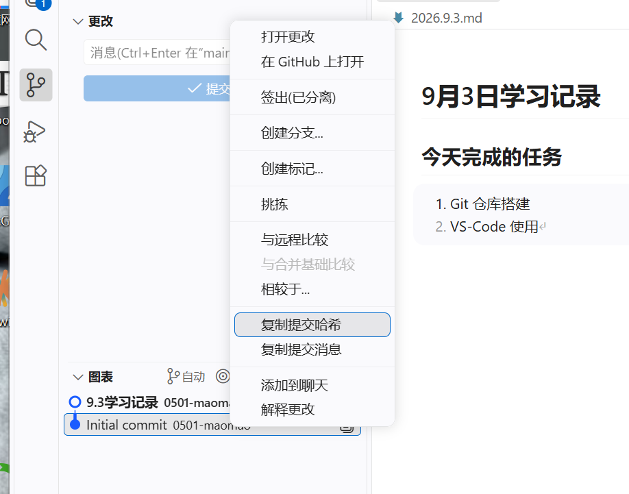

# 9月3日学习记录

## 今天完成的任务
1. Git 仓库搭建
2. VS‑Code 使用

## 学习笔记

### git init
作用：将普通文件夹初始化为 Git 仓库。
初始化之后文件夹内会生成隐藏的 `.git` 文件夹，Git 依靠这个文件夹完成版本管理。
如果删除 `.git` 文件夹，该文件夹就不再被 Git 管理。

`.gitignore` 文件：用来指定哪些文件、文件夹被 Git 忽略，不会被跟踪、上传到仓库（比如缓存文件、虚拟环境文件等）。

AI提示词参考：
> 对这个目录进行 git 初始化，注意把不需要的内容排除掉。

作用：建立 Git 仓库，同时配置 `.gitignore`，把不需要纳入版本管理的内容过滤出去。

我的仓库对应关系：
- 远程仓库（GitHub）：`learning‑log`
- 本地仓库：电脑上这个存放全部日志的文件夹

---

### Git 的四个分区以及互相之间如何转换
1. **工作区（Working Directory）**
    就是我们在资源管理器、VS Code里直接编辑的文件夹，是看得见、能直接修改文件的地方。
    文件修改之后，改动只停留在工作区，Git还不会记录它。

2. **暂存区（Stage / Index）**
    一个临时清单，用来挑选“哪些改动要被记录到下一次快照里”。
    命令：`git add 文件名` / `git add .`
    👉转换：**工作区 → 暂存区**，把改动加入待提交清单。

3. **本地仓库（Local Repository）**
    隐藏文件夹 `.git`，所有历史快照、commit id、分支信息都存在这里。
    命令：`git commit -m "备注"`
    👉转换：**暂存区 → 本地仓库**，把暂存区里的改动保存成一份永久快照，生成唯一commit id。

4. **远程仓库（Remote Repository，比如GitHub）**
    存放在网络服务器上的仓库，用来备份、多人协作。
    - `git clone 仓库地址`：**远程仓库 → 工作区+本地仓库**，把整个网上仓库下载到电脑。
    - `git push`：**本地仓库 → 远程仓库**，把本地新的快照上传到GitHub。
    - `git fetch`：**远程仓库 → 本地仓库（仅更新origin/main镜像）**，只下载信息，不改动工作区文件。
    - `git pull`：`git fetch + git merge`，**远程仓库 → 本地仓库 → 工作区**，下载更新并且合并到当前文件。

完整流程总结：
编辑文件（工作区）→`git add`→暂存区→`git commit`→本地仓库→`git push`→远程仓库(GitHub)。

---

### git commit
`git commit` 的作用是保存一份仓库**快照**。
每执行一次 commit，就给当前所有被跟踪文件的状态拍一张“存档照片”，同时可以写上备注说明这次改动。

每一次提交都会生成唯一的**提交哈希（commit id，一长串编号）**，VS Code里可以复制这个哈希值。

1. **彻底回退，不要后面所有改动**
提示词：
> 将仓库还原到这个 id 编号这次提交的状态，后面所有改动都不要了。

对应命令：
```bash
git reset --hard 【复制的commit id】
 
 
⚠️这条命令会丢弃 commit id 之后所有未提交、已提交的改动，谨慎使用！
 
2. 撤销某一次提交，但保留其他所有历史记录不变
提示词：
 
把这一次提交撤销掉，保持其他提交不变。
 
对应命令：
 
bash
  
git revert 【复制的commit id】
 
 
 git revert  不会删掉旧的提交记录，它会新建一条反向提交来抵消那次改动，整条版本历史完整保留，适合已经推送到远程仓库、不能随意删除历史的场景。
 
⚠️注意：
 commit  只是把快照存到本地 Git，并没有上传到 GitHub；
需要再执行【同步更改】（push），这份快照才会同步到远程 GitHub 仓库。
 
 
 
main 与 origin/main 的区别
 
-  main ：本地 main 分支，存在我的电脑上。我在这里编辑文件、执行  git commit ，可以直接修改。
-  origin/main ：远程跟踪分支，它只是保存在本地的一份镜像，记录上一次  fetch  时 GitHub 上  main  分支是什么样子，不能直接编辑。
-  git fetch ：去 GitHub 查询更新，刷新  origin/main  这个镜像，不会改动我正在写的文件。
- 同步更改：先拉取远程更新（对比  origin/main ），再把本地  main  的提交推送到 GitHub。
 
 
 
HEAD
 
HEAD 是 Git 的头指针，它标记「我当前正在哪个提交、哪个分支上工作」。
 
- 当你在  main  分支时： HEAD → main → 最新的commit id 
- 可以把它想象成书签：它指着你现在正在操作的那一个快照。
-  git reset --hard xxx ：移动 HEAD 指针，并且把文件全部改成对应提交的状态，后面历史直接抹掉。
-  git revert xxx ：HEAD 继续往前走，新增一个反向提交去抵消旧改动，不去改动旧的历史记录。
 
 
 
CodeX 中创建 worktree（工作树）
 
普通 Git 仓库同一时间只能检出一个分支，如果要切换另一条分支，文件会被覆盖。
 worktree （工作树）可以让同一个  .git  版本库同时拥有多个独立的工作文件夹：
 
- 各个工作树可以分别锁定在不同分支上，并行工作，不用来回切换分支；
- 所有工作树共享同一套提交历史数据库，文件编辑互不干扰。
 
给AI创建工作树的提示词示例：
 
给当前仓库新建一个 worktree，路径为  ./test‑branch‑worktree ，检出 test‑branch 分支，不要影响 main 分支里正在编辑的文件。
 
底层 Git 命令：
 
bash
  
git worktree add ./test‑branch‑worktree test‑branch
 
 
功能分支调试完成后，可以合并回主干：
 
把xxx分支合并进主干(main)，如果遇到代码冲突就停下来，不要自动解决，交给我选择如何处理冲突。
 
合并确认无误后，提交并  push  到远程仓库。
用完工作树，删除文件夹后执行
 
bash
  
git worktree prune
 
 
清理记录。
 